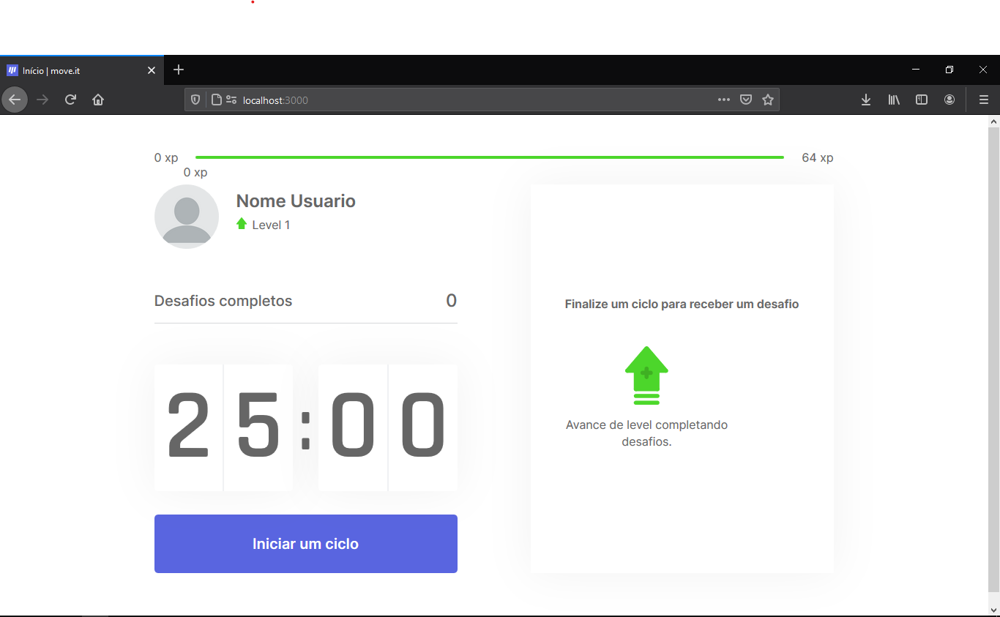
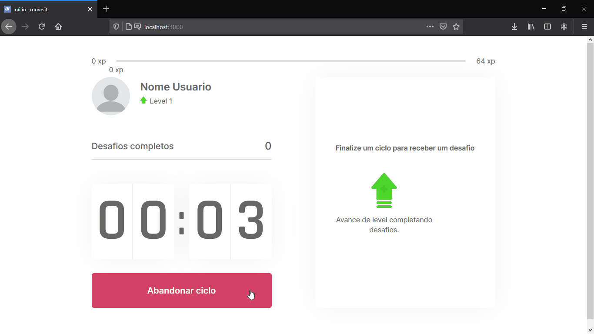

# Move.it
<h1>
  
</h1>

<h1>
  
</h1>

<h3 align='center'>
  <a href='https://pomodoto-moveit-gab1005.vercel.app/' target="_blank">Acessar a aplicação</a>
</h3>

---
## Indice
- [Sobre](#-Sobre)
- [Status do Projeto](#-status-do-projeto)
- [Funções](#-Funções)
- [Tecnologias](#-tecnologias)
- [Como baixar](#-como-baixar)
- [Autor](#-autor)
- [Licença](#-licença)

---
## Sobre
Moveit é uma aplicação feita durante a Next Level Week (NLW) pela <a href="https://rocketseat.com.br/" target="_blank">RocketSeat</a>, seu objetivo é ser uma aplicação do estilo pomodoro, com intervalos feitos por exercícios de relaxamento muscular ou relaxamento para os olhos.

---
## Status do Projeto
Em andamento

---
## Funções
- [X] Interface da aplicação
- [X] Salvar dados por meio de cookies do navegador
- [ ] Login com github
- [ ] Configuração do tempo do pomodoro
- [ ] Pular um exercício para fazer outro

---
## Tecnologias
- <a href="https://nextjs.org/" target="_blank">Next.js</a>
- <a href="https://pt-br.reactjs.org/" target="_blank">React.js</a>
- <a href="https://www.typescriptlang.org/" target="_blank">TypeScript</a>

## Como Baixar
```bash
# No terminal, e no diretorio de sua escolha, copie e cole.
git clone https://github.com/gab1005/MoveIt_NLW.git
# ou use a opção de download.

# Entre na pasta moveit-next
cd moveit-next

# Instalando dependências
yarn install

# Para executar
yarn dev

# Acesse http://localhost:3000 no seu navagador para ver o resultado em tempo de produção

# Existem outras possibilidades de dependências, como npm, neste caso utilize para instalar
npm install

# Para executar o projeto pelo npm
npm run
# ou, para funcionalidades de desenvolvendor
npm run dev

# O site sera executado na mesma porta http://localhost:3000

# Para duvidas quanto ao yarn ou npm, acesse
https://yarnpkg.com/

https://www.npmjs.com/
```
---
## Autor
Desenvolvido por <a href="https://www.linkedin.com/in/sousaggabriel/" target="_blank">Gabriel Sousa</a>

---
## Licença
Este projeto esta sobe a licença [MIT](./LICENSE).
